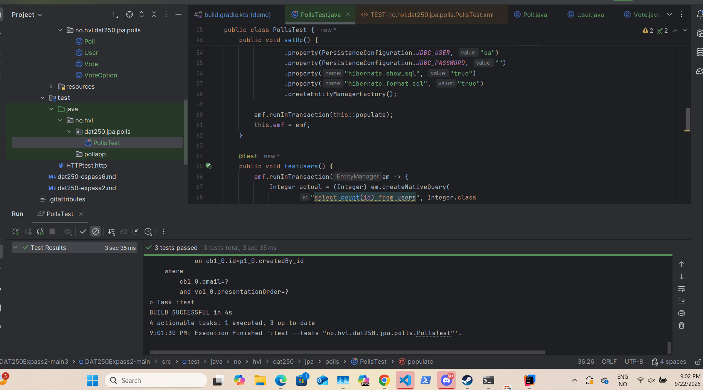

## Assignment 5 Lyder Samnøy

For this task, i had quite a bit of trouble following the instructions, and it took a long time to figure out how to get PollsTest to pass.
I was stuck for quite some time failing to load in the new dependencies as i did not know i had to sync them to update the rest of the programme.

It was difficult to figure out what where the java files were supposed to go and what exactly was changing.
I also had some problems when the test failed because an empty binary folder in test-results refused to be deleted.

PollsTest produced several tables that could be viewed as output in the terminal

users, polls, votes, voteoptions, etc.

It then seems to populate the tables with the relevant objects and iterate through them.
honestly it's quite hard to read as pure terminal output.

here is an image of the tests passing in intelliJ:

