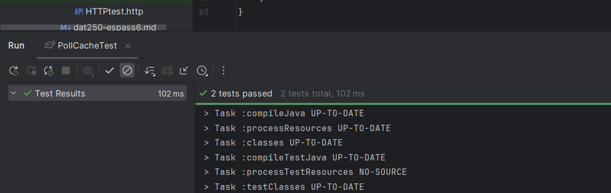

## DAT250 ASSIGNMENT 5: REDIS

### Group members:
#### - Lyder Samnøy

### Installation
I followed the instructions on redis.io and installed via WSL, no issues.

### Development
When writing PollCache, ChatGPT recommended me to use Jedis Pool, arguing that it was more elegant and resource-efficient than only using jedis. So, i decided to look into it, and ultimately decided to use it in my implementation. With Jedis Pool, before an operation, you request your instance from a pool instead of creating a new instance every time.

I also created a test class PollCacheTest to test if PollCache worked properly, it tests that the data is actually stored via redis. The second test tests that the data can be deleted properly.

I ran into issues with the build that i think stem from how it is set up in the repo. When I compile, IntelliJ gets stuck trying to delete empty files and a shoddy binary file. So i had to troubleshoot and delete the files manually to get the program to run.

